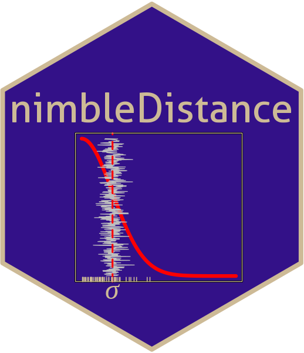

## nimbleDistance: functions for Distance Sampling models in [nimble](https://https://r-nimble.org/)

This repository provides some user-defined distributions that can be used to implement distance sampling models in nimble:

* likelihoods for common distance-detection distributions hazard-rate and half-normal

The package is at a very early stage of development. Suggestions for improvement and contributions of code are very welcome.

### Installation:

```
devtools::install_github("scrogster/nimbleDistance")
```
